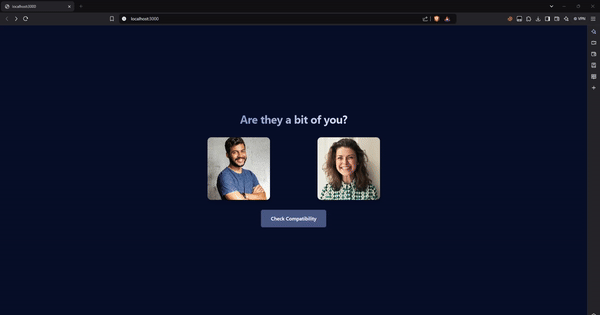

# abitofyou.ai
This web app is designed to experiment with the OpenAI API and AWS S3 buckets. It sends images to the Next.js server, which creates a signed URL for the image and sends it to the OpenAI API. The API returns the text, and the server sends the text to the client.



## Getting Started

First, run the development server:

```bash
npm run dev
# or
yarn dev
# or
pnpm dev
# or
bun dev
```

Open [http://localhost:3000](http://localhost:3000) with your browser to see the result.

You can start editing the page by modifying `src/pages/index.tsx`. The page auto-updates as you edit the file.